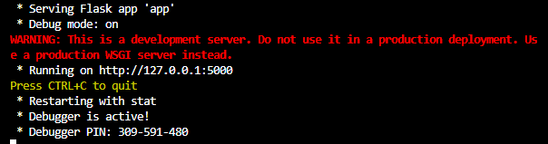

<!-- A compléter -->
# API Flask


## Description

**API REST** construite avec les librairies **Flask**, **SQLAlchemy** et **JWT**, et qui gère les fonctionnalités suivantes :

- **Gestion des utilisateurs / accès :**
  - Inscription avec création de rôles (`/api/auth/register`)
  - Authentification sécurisée avec génération de token JWT (`/api/auth/login`)
  - Autorisation avec permissions selon le rôle (`@access_granted`)

- **Gestion des produits :**
  - Navigation, affichage et recherche (`public`)
  - Création, modification et suppression (`admin`)

- **Gestion des commandes :**
  - Création et consultation (selon permissions `admin`, `client`)
  - Modification du statut (`admin`)

<br>

Elle repose sur une architecture modulaire avec séparation des responsabilités (modèle de type MVC) `Routes` → `Services` → `Modèles` → `DataBase`, où :

- **Routes** : exposition de l’API et application des contrôles d’accès
- **Services** : description de la logique métier et des interactions avec la base
- **Modèles** : définition des tables et relations (SQLAlchemy)

<br>

## Structure du projet

```
my-ecommerce-api/
│
├── app.py                      # Point d’entrée API (+ Blueprints)
├── config.py                   # Paramêtres de configuration Flask/SQLAlchemy
│
├── core/                       # Middleware sécurité ( + auth JWT)
│   ├── __init__.py                 ← 
│   ├── auth_utils.py               ← contient les logiques Authentification/Autorisation
│   └── auth.py                     ← JWT + décorateurs (`@auth_required`, `@access_granted`)
│
├── database/                   # (à venir)
│
├── model/                      # ORM SQLAlchemy (mdolèles, gestion des sessions)
│   ├── __init__.py                 ← 
│   ├── database.py                 ← contient Engine & Base
│   ├── sessions.py                 ← contient Sessions + Handler des erreurs SQLAlchemy
│   └── models.py                   ← contient les modèles SQLAlchemy (User, Product)
│
├── routes/                     # Routes par domaine/scope
│   ├── __init__.py                 ← 
│   ├── auth_routes.py              ← contient les routes `api/auth/register` et `api/auth/login`
│   ├── main_routes.py              ← contient `/` (home)
│   ├── order_routes.py             ← contient les routes `/api/commandes`, `/api/commandes/{id}`
│   ├── product_routes.py           ← contient les routes `/api/produits` et `/api/produits/{id}`
│   │
│   └── to_test_routes.py           ← contient les routes pour tests manuels (temporaire)
│
├── services/                   # Logique métier
│   ├── __init__.py                 ← 
│   ├── product_utils.py            ← contient les utilitaires pour les routes `produits`
│   └── order_utils.py              ← contient les utilitaires pour les routes `commandes`
│
├── tests/                      # Tests unitaires et fonctionnels
│   ├── __init__.py                 ← 
│   ├── conftest.py                 ← fichier de configuration/centralisation des fixtures
│   ├── report.html                 ← rapport des résultats de tests pytest (HTML) (optionnel)
│   ├── test_users.py               ← fichier pytest pour `User`
│   ├── test_products.py            ← fichier pytest pour `Product`
│   └── test_orders.py              ← fichier pytest pour `Order`
│
├── .gitignore
├── requirements.txt            # Liste des dépendances python (à venir)
└── README.md                   # (documentation en développement)
```


### Prérequis

L'implémentation du code nécessite :

    - Python >= 3.12
    - conda / virtualenv + pip

<br>

L'utilisation de l'outil SQLite (DB Browser) est optionnelle; elle permet néanmoins de vérifier :
- le schéma de la Base,
- la création des tables,
- les données enregistrées, modifiées ou supprimées.

<br>

### Installation (Conda, Linux/Windows)

1. Clonez le projet

```bash
git clone https://github.com/filrouge/my-ecommerce-api.git
cd my-ecommerce-api
```

2. Créez et activez l'environnement virtuel

```bash
# Conda
conda venv -n api_venv
conda activate api_venv

# Linux/Mac
python -m venv venv
source venv/bin/activate

# Windows
python -m venv venv
venv\Scripts\activate
```

3. Installez les dépendances

```bash
pip install --upgrade pip
pip install -r requirements.txt
```

<br>

### Configuration

Une fois le projet cloné et l'environnement crée, modifiez le fichier `config.py` avec vos propres valeurs :

```
DATABASE_URL=sqlite:///path-to-database.db

JWT_SECRET_KEY=your-jwt-secret
```


### Lancement

Exécutez `python app.py` ou `flask run --debug`.

L'API est accessible sur : http://127.0.0.1:5000, avec le mode DEBUG pour développement.

<!--  -->

<br>

## API Endpoints

### Cartographie des routes

| Méthode     | Endpoint                     | Accès        | Description                                 |
|-------------|------------------------------|--------------|---------------------------------------------|
| **POST**    | `/api/auth/register`         |              | Inscription (email, password)               |
| **POST**    | `/api/auth/login`            |              | Connexion (avec retour de token JWT)        |
|-------------|------------------------------|--------------|---------------------------------------------|
| **GET**     | `/api/produits`              | Public       | Liste tous les produits                     |
| **POST**    | `/api/produits`              | Admin        | Création de produit dans le catalogue       |
| **GET**     | `/api/produits/{id}`         | Public       | Détail d'un produit spécifique              |
| **PUT**     | `/api/produits/{id}`         | Admin        | Mise à jour des caractéristiques de produit |
| **DELETE**  | `/api/produits/{id}`         | Admin        | Suppression d'un produit spécifique         |
|-------------|------------------------------|--------------|---------------------------------------------|
| **GET**     | `/api/commandes`             | Client/Admin | Liste toutes les commandes admin ou client  |
| **POST**    | `/api/commandes`             | Client       | Création de commandes                       |
| **GET**     | `/api/commandes/{id}`        | Client/Admin | Détails d'une commande spécifique           |
| **PATCH**   | `/api/commandes/{id}`        | Admin        | Mise à jour du statut de la commande        |
| **GET**     | `/api/commandes/{id}/lignes` | Client/Admin | Liste les lignes d'une commande spécifique  |

<br>

### Format des JSON d'entrée

Ce tableau présente le `Body` des requêtes CRUD (via cURL, Postman ...) pour les fonctionnalités correspondantes.

| Fonctionnalité                       | Body |
|--------------------------------------|---------|
| Inscription                          | ``` {"email": "client@test.com", "nom":"clienttestcom", "password":"secret"} ``` |
| Connexion                            | ``` {"email": "admin@test.com", "password":"password"} ``` |
| Création de produit                  | ``` {"nom": "Produit Test", "prix":99.9, "quantite_stock":5} ``` |
| Mise à jour d'un produit             | ``` {"nom": "Produit Modifié", "prix":79.9, "quantite_stock":10} ``` |
| Création de commande                 | ``` { "adresse_livraison": "4 rue d'ici, 75000 Paname", "produits": [{"id": 1, "quantite": 2},{"id": 2, "quantite": 1}] } ``` |
| Mise à jour statut d’une commande    | ``` {"statut": "Expédiée"} ``` |

<br>

### Utilisation (avec `cURL`) -> *checker si déplacer sur autre document annexe*

Les exemples suivants, formatés pour cURL, fournissent les `body` (des requêtes) attendus et le format JSON des réponses associées :

<br>

#### Authentification


##### 1. Inscription (**POST** `/api/auth/register`)

<small>**Requête :**</small>

```bash
curl -X POST http://127.0.0.1:5000/api/auth/register \
-H "Content-Type: application/json" \
-d '{"email":"client@test.com","nom":"clienttestcom","password":"secret"}'
```

<small>**Réponse (201 Created)**</small>

```javascript
{
  "message": "Utilisateur créé",
  "user": {
    "id": 1,
    "email": "client@test.com",
    "nom":"clienttestcom",
    "role": "client"
  }
}
```

<br>

##### 2. Connexion (login + token JWT) (**POST** `/api/auth/login`)

<small>**Requête :**</small>

```bash
curl -X POST http://127.0.0.1:5000/api/auth/login \
-H "Content-Type: application/json" \
-d '{"email":"admin@test.com","password":"password"}'
```

<small>**Réponse (200 OK)**</small>

```json
{
  "message": "Connection succeed",
  "token": "JhbGciOiJIUz..."
}
```

<br>

#### Produits


##### 1. Création de produit (**POST** `/api/produits` - *headers:* `Authorization: Bearer <token>`)

<small>**Requête :**</small>

```bash
curl -X POST http://127.0.0.1:5000/api/produits \
-H "Content-Type: application/json" \
-H "Authorization: Bearer <token_admin>" \
-d '{"nom":"Produit","description":"Desc","categorie":"Cat","prix":99.9,"quantite_stock":5}'
```

<small>**Réponse (201 Created)**</small>

```json
{
  "message": "Produit ajouté",
  "produit": {
    "id": 3,
    "nom": "Produit",
    "description": "Desc",
    "categorie": "Cat",
    "prix": 99.9,
    "quantite_stock": 5
  }
}
```

##### 2. Liste les produits (**GET** `/api/produits`)

<small>**Requête :**</small>

```bash
curl -X GET http://127.0.0.1:5000/api/produits
```

<small>**Réponse (200 OK)**</small>

```json
[
  {
    "id": 1,
    "nom": "Produit A",
    "description": "Desc A",
    "categorie": "Cat A",
    "prix": 50.0,
    "quantité_stock": 10
  },
  {
    "id": 2,
    "nom": "Produit B",
    "description": "Desc B",
    "categorie": "Cat B",
    "prix": 25.5,
    "quantité_stock": 3
  }
]
```

##### 3. Détails d'un produit (**GET** `/api/produits/{id}`)

<small>**Requête :**</small>

```bash
curl -X GET http://127.0.0.1:5000/api/produits/1
```

<small>**Réponse (200 OK)**</small>

```json
{
  "id": 1,
  "nom": "Produit A",
  "description": "Desc A",
  "categorie": "Cat A",
  "prix": 50.0,
  "quantite_stock": 10
}
```

##### 4. Mise à jour d'un produit (**PUT** `/api/produits/{id}` - *headers:* `Authorization: Bearer <token>`)

<small>**Requête :**</small>

```bash
curl -X PUT http://127.0.0.1:5000/api/produits/3 \
-H "Content-Type: application/json" \
-H "Authorization: Bearer <token_admin>" \
-d '{"nom":"Produit modifié","prix":79.9,"quantite_stock":10}'
```

<small>**Réponse (200 OK)**</small>

```json
{
  "message": "Produit mis à jour",
  "produit_id": 3,
  "produit": {
    "id": 3,
    "nom": "Produit modifié",
    "description": "Desc A",
    "categorie": "Cat A",
    "prix": 79.9,
    "quantite_stock": 10
  }
}
```

##### 5. Suppression d'un produit (**DELETE** `/api/produits/{id}` - *headers:* `Authorization: Bearer <token>`)

<small>**Requête :**</small>

```bash
curl -X DELETE http://127.0.0.1:5000/api/produits/3 \
-H "Authorization: Bearer <token_admin>"
```

<small>**Réponse (200 OK)**</small>

```json
{
  "message": "Produit 3 supprimé"
}
```

<br>

#### Commandes

##### 1. Création de commande (**POST** `/api/commandes` - *headers:* `Authorization: Bearer <token>`)

<small>**Requête :**</small>

```bash
curl -X POST http://127.0.0.1:5000/api/commandes \
-H "Content-Type: application/json" \
-H "Authorization: Bearer <token_client>" \
-d '{"adresse_livraison": "4 rue d'ici, 75000 Paname","produits": [{"produit_id": 1, "quantite": 2},{"produit_id": 2, "quantite": 1}]}'
```

<small>**Réponse (201 Created)**</small>

```json
{
  "message": "Commande id:11 créée",
  "commande": {
    "id": 11,
    "utilisateur_id": 1,
    "adresse_livraison": "4 rue d'ici, 75000 Paname",
    "statut": "En attente",
    "date_commande": "20250101"
  }
}
```

##### 2. Lister les commandes (**GET** `/api/commandes` - *headers:* `Authorization: Bearer <token>`)

<small>**Requête :**</small>

```bash
curl -X GET http://127.0.0.1:5000/api/commandes \
-H "Authorization: Bearer <token_admin>"  # <token_client> pour ses propres commandes
```

<small>**Réponse (200 OK)**</small>

```json
[
  {
    "id": 11,
    "utilisateur_id": 1,
    "adresse_livraison": "4 rue d'ici, 75000 Paname",
    "statut": "En attente",
    "date_commande": "20250101"
  },
  {
    "id": 12,
    "utilisateur_id": 2,
    "adresse_livraison": "5 rue de là, 75001 Paname",
    "statut": "Expédiée",
    "date_commande": "20250301"
  }
]
```

##### 3. Détails d’une commande (**GET** `/api/commandes/{id}` - *headers:* `Authorization: Bearer <token>`)

<small>**Requête :**</small>

```bash
curl -X GET http://127.0.0.1:5000/api/commandes/11 \
-H "Authorization: Bearer <token_client>"
```

<small>**Réponse (200 OK)**</small>

```json
{
  "id": 11,
  "utilisateur_id": 1,
  "adresse_livraison": "4 rue d'ici, 75000 Paname",
  "statut": "En attente",
  "date_commande": "20250101"
}
```

##### 4. Mise à jour de statut d’une commande (**PATCH** `/api/commandes/{id}` - *headers:* `Authorization: Bearer <token>`)

<small>**Requête :**</small>

```bash
curl -X PATCH http://127.0.0.1:5000/api/commandes/11 \
-H "Content-Type: application/json" \
-H "Authorization: Bearer <token_admin>" \
-d '{"statut": "Expédiée"}'
```

<small>**Réponse (200 OK)**</small>

```json
{
  "message": "Statut mis à jour",
  "commande": {
    "id": 11,
    "utilisateur_id": 1,
    "adresse_livraison": "4 rue d'ici, 75000 Paname",
    "statut": "Expédiée",
    "date_commande": "20250101"
  }
}
```

##### 5. Détails des lignes d’une commande (**GET** `/api/commandes/{id}/lignes` - *headers:* `Authorization: Bearer <token>`)

<small>**Requête :**</small>

```bash
curl -X GET http://127.0.0.1:5000/api/commandes/11/lignes \
-H "Authorization: Bearer <token_client>"
```

<small>**Réponse (200 OK)**</small>

```json
[
  {
    "id": 1,
    "commande_id": 1,
    "produit_id": 1,
    "quantite": 2,
    "prix_unitaire": 79.9
  },
  {
    "id": 2,
    "commande_id": 1,
    "produit_id": 2,
    "quantite": 1,
    "prix_unitaire": 25.0
  }
]
```

<br>

## Gestion des erreurs/exceptions

Les erreurs applicatives (métier) et SQLAlchemy (back-end) sont gérées de manière disctincte.

Elles sont renvoyées sous forme de messages, via `jsonify({"error": ...})`, explicitant la cause et le code associé. 


### Erreurs applicatives

Les erreurs applicatives remontées par l'API reposent sur les exceptions centralisées (avec codes HTTP correspondants) du fichier `exceptions_utils.py` :

- **BadRequestError** (`400 Bad Request`) : données d'entrée manquantes/invalides (validation payload/body)
- **UnauthorizedError** (`401 Unauthorized`) : authentification manquante ou JWT invalide/absent.
- **ForbiddenError** (`403 Forbidden`) : accès non autorisé (restriction POST/PUT/DELETE ou PATCH)
- **NotFoundError** (`404 Not Found`) : ressource absente ou inexistante

<br>

| Domaine          | Erreur                               | Code | Message            |
|------------------|--------------------------------------|------|--------------------|
| Authentification | Email manquant ou invalide           | 400  | BadRequestError    |
| Authentification | Email ou mot de passe incorrect      | 403  | ForbiddenError     |
| Authentification | Token manquant                       | 401  | UnauthorizedError  |
| Authentification | Token expiré                         | 401  | UnauthorizedError  |
| Authentification | Token invalide                       | 401  | UnauthorizedError  |
| Authentification | Client introuvable                   | 404  | NotFoundError      |
| Authentification | Adresse e-mail déjà utilisée         | 400  | BadRequestError    |
| Authentification | Identifiants invalides               | 403  | ForbiddenError     |
| Autorisation     | Action non autorisée                 | 403  | ForbiddenError     |
| Autorisation     | Accès refusé                         | 403  | ForbiddenError     |
| Produits         | Produit introuvable                  | 404  | NotFoundError      |
| Produits         | Nom, prix ou quantite manquant       | 400  | BadRequestError    |
| Produits         | Prix invalide                        | 400  | BadRequestError    |
| Produits         | Quantité invalide                    | 400  | BadRequestError    |
| Commandes        | Commande introuvable                 | 404  | NotFoundError      |
| Commandes        | Ligne de Commande introuvable        | 404  | NotFoundError      |
| Commandes        | Produit ou adresse manquant          | 400  | BadRequestError    |
| Commandes        | Statut manquant pour update          | 400  | BadRequestError    |
| Commandes        | Statut invalide                      | 400  | BadRequestError    |
| Commandes        | Accès aux autres commandes           | 403  | ForbiddenError     |
| Commandes        | Ligne de commande vide ou invalide   | 403  | ForbiddenError     |
|------------------|--------------------------------------|------|--------------------|
| Commun           | JSON invalide                        | 400  | BadRequestError    |
| Commun           | Champs manquant(s)                   | 400  | BadRequestError    |

<br>

### Erreurs SQLAlchemy

La gestion des erreurs SQLAlchemy est centralisée via un `errorhandler`.

Celui-ci fournit des *messages personnalisés* sous la forme : `{"error": "DataBase - <message>"}, <code>` en s'appuyant sur le tableau suivant :

| Exception                |     Code     |                       Cause                         |
|--------------------------|--------------|-----------------------------------------------------|
| **DataError**            |     `400`    |     Type/Format de données invalide                 |
| **IntegrityError**       |     `409`    |     Violation de contraintes (unique, null, fk …)   |
| **StatementError**       |     `500`    |     Erreur dans l’exécution SQL                     |
| **autres**               |     `500`    |     Erreur interne inconnue                         |
| **OperationalError**     |     `503`    |     Problème côté DataBase (connexion, timeout…)    |


<br>

## Tests


### Run

Les fonctionnalités de l'API sont vérifiées par des tests unitaires qui s'appuient sur la librairie `pytest`. Ils s'appuient sur des fichiers dédiés à chaque domaine de routes (i.e. `test_users.py`, `test_products.py` et `test_orders.py`).

Executez les commandes suivantes pour lancer les tests voulus depuis la racine du projet (avec l'option `--maxfail=1 --disable-warnings` si besoin) :

- `pytest -v` pour cibler tous les tests
- `pytest -v tests/test_users.py` pour cibler un seul fichier de tests
- `pytest -vv tests/test_users.py` pour afficher le détail des assertions
- `pytest -v tests/test_users.py::TestLogin` pour cibler un seul module de tests
- `pytest -v tests/test_users.py::TestAdminAccess::test_access_denied` pour cibler un test spécifique

<br>

*Optionel:* Pour générer un rapport de tests `<mon-rapport-pytest>.html`, executez les commandes suivantes :

`pip install pytest-html`
`pytest -vv test_products.py --html=<mon-rapport-pytest>.html --self-contained-html`

<br>

### Couverture
*TODO: vérifier que les test_*.py couvre bien les aspects critiques et importants*

Les tests unitaires couvrent, entre-autres, les points suivants:

- Inscription (`/api/auth/register`)
  - Email unique
  - Mot de passe haché
  - Rôle (défaut = client)

- Connexion (`/api/auth/login`)
  - Validée avec token JWT renvoyé
  - Refusée si mauvais mot de passe

- Accès restreint (`/api/admin-only-route`)
  - Autorisé pour `admin`
  - Autorisé pour `client`
  - Refusé pour autre que `admin`
  - Refusé pour autre que `client` propriétaire

- Produits (`/api/produits`)
  - Liste de tous les produits
  - Recherche par nom, catégorie ou disponibilité
  - Création de produit (`admin` only)
  - Mise à jour de produit (`admin` only)
  - Suppression de produit (`admin` only)

- Commandes (`/api/commandes`)
  - Création de commande (`client` only)
  - Consultation des commandes (`client` propriétaire)
  - Consultation de tous les commandes (`admin` only)
  - Consultation des lignes d'une commande  # (`public` !!!)
  - Modification de statut d’une commande (`admin` only)


<br>

###### Statut

TODO:
- Refactoring des tests via fixtures (*feed_product*, *feed_order*)
- Documentation interne du code
- Ad-ons:
    - Passage à Logger pour le monitoring (MEP)
    - Scripts `seed_data.py` (alimentation des tables)