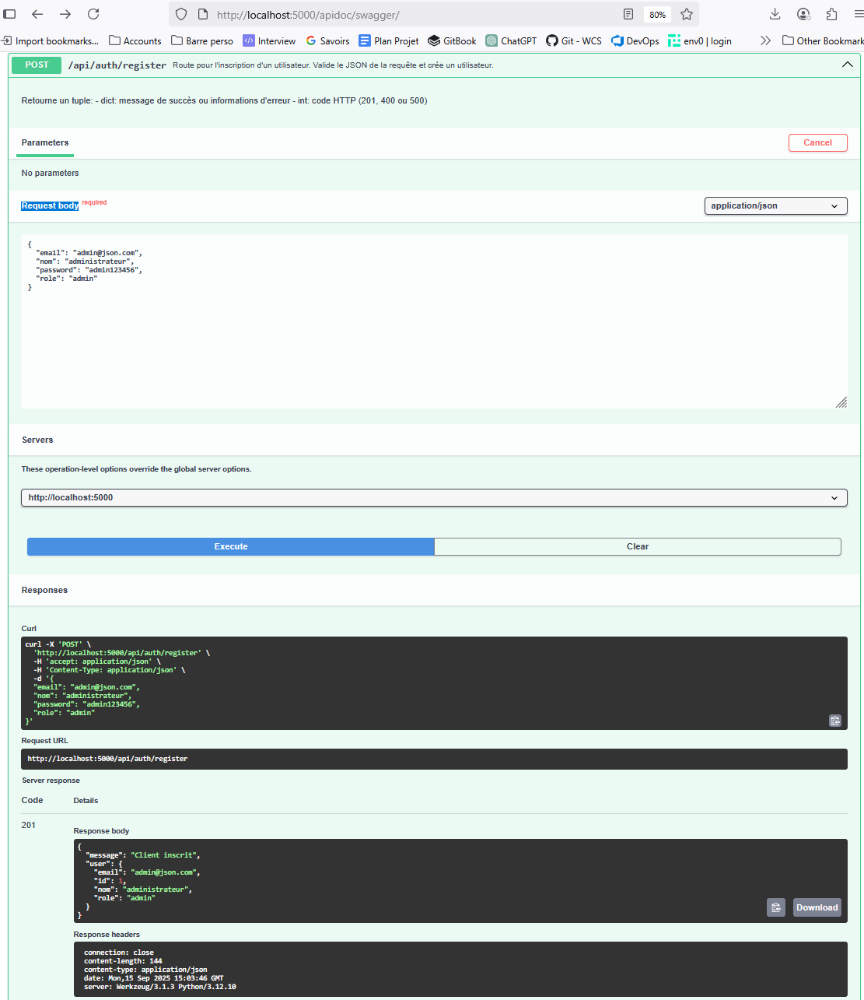
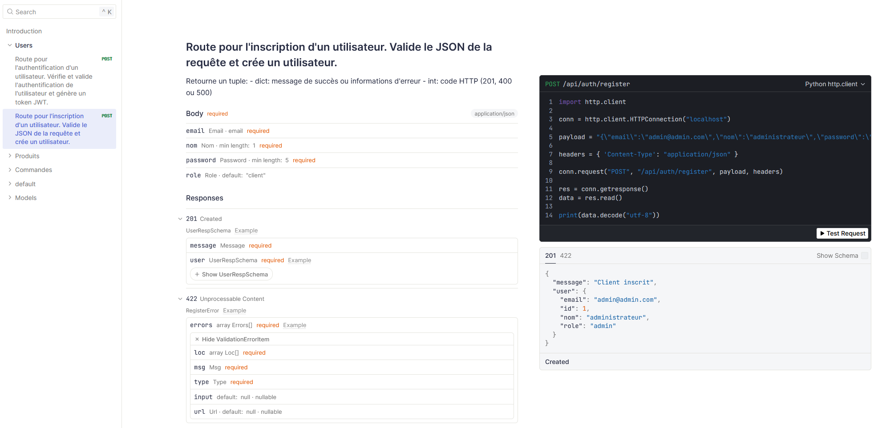
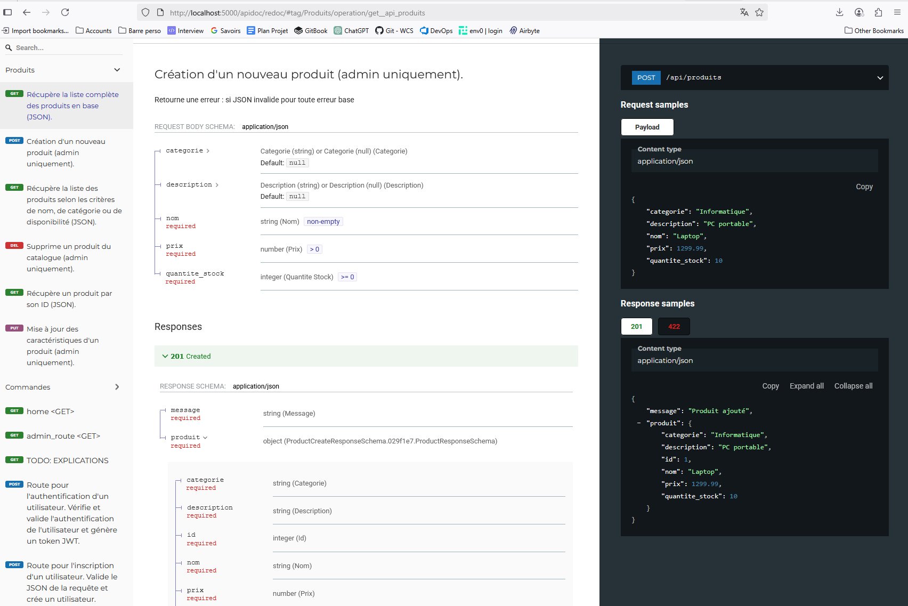

# Documentation API

Ce fichier contient la documentation détaillée des endpoints de l’API Flask e-commerce.

<br>

## 📄 Description

Elle est construite avec les librairies **Flask**, **SQLAlchemy** et **JWT**, et gère les fonctionnalités suivantes :

- *Gestion des utilisateurs / accès :*
  - Inscription avec création de rôles (`/api/auth/register`)
  - Authentification sécurisée avec génération de token JWT (`/api/auth/login`)
  - Autorisation avec permissions selon le rôle (`@access_granted`)

<br>

- *Gestion des produits :*
  - Navigation, affichage et recherche (`public`)
  - Création, modification et suppression (`admin`)

<br>

- *Gestion des commandes :*
  - Création et consultation (selon permissions `admin`, `client`)
  - Modification du statut (`admin`)

<br>

L'architecture modulaire assure une continuité `routes` → `services` → `model` → `DataBase`, où :
- les *routes* exposent l’API avec des contrôles d’accès
- les *services* décrivent la logique métier et les interactions avec la base
- les *models* définissent des tables et relations (SQLAlchemy)

<br>

---

## 📍 API Endpoints

### Cartographie

| Méthode   | Endpoint                     | Accès        | Description                                 |
|-----------|------------------------------|--------------|---------------------------------------------|
| *POST*    | `/api/auth/register`         |              | Inscription (email, password)               |
| *POST*    | `/api/auth/login`            |              | Connexion (avec retour de token JWT)        |
|-----------|------------------------------|--------------|---------------------------------------------|
| *GET*     | `/api/produits`              | Public       | Liste tous les produits                     |
| *POST*    | `/api/produits`              | Admin        | Création de produit dans le catalogue       |
| *GET*     | `/api/produits/{id}`         | Public       | Détail d'un produit spécifique              |
| *PUT*     | `/api/produits/{id}`         | Admin        | Mise à jour des caractéristiques de produit |
| *DELETE*  | `/api/produits/{id}`         | Admin        | Suppression d'un produit spécifique         |
|-----------|------------------------------|--------------|---------------------------------------------|
| *GET*     | `/api/commandes`             | Client/Admin | Liste toutes les commandes admin ou client  |
| *POST*    | `/api/commandes`             | Client       | Création de commandes                       |
| *GET*     | `/api/commandes/{id}`        | Client/Admin | Détails d'une commande spécifique           |
| *PATCH*   | `/api/commandes/{id}`        | Admin        | Mise à jour du statut de la commande        |
| *GET*     | `/api/commandes/{id}/lignes` | Client/Admin | Liste les lignes d'une commande spécifique  |

<br>

### Formats JSON

Ce tableau présente le `Body` des requêtes CRUD (via cURL, Postman ...) pour les fonctionnalités correspondantes.  

| Fonctionnalité                       | Body |
|--------------------------------------|------|
| I*nscription*                        | ``` {"email": "client@test.com", "nom":"clienttestcom", "password":"secret"} ``` |
| *Connexion*                          | ``` {"email": "admin@test.com", "password":"password"} ``` |
| *Création de produit*                | ``` {"nom": "Produit Test", "prix":99.9, "quantite_stock":5} ``` |
| *Mise à jour d'un produit*           | ``` {"nom": "Produit Modifié", "prix":79.9, "quantite_stock":10} ``` |
| *Création de commande*               | ``` { "adresse_livraison": "4 rue d'ici, 75000 Paname", "produits": [{"id": 1, "quantite": 2},{"id": 2, "quantite": 1}] } ``` |
| *Mise à jour statut d’une commande*  | ``` {"statut": "Expédiée"} ``` |

<br>




<br>

#### Exemples cURL

> Les exemples suivants, formatés pour cURL, fournissent les `body` (des requêtes) attendus et le format JSON des réponses associées.  
> La présence de *headers* (`Authorization: Bearer <token>`) dans les *body* est obligatoire pour obtenir les droits nécessaires à l'exécution des actions CRUD avec permissions.

<br>

<details>
<summary>🔑 Authentification</summary>

🆕 **Inscription** (*POST* `/api/auth/register`)

<small>*Requête :*</small>

```bash
curl -X POST http://127.0.0.1:5000/api/auth/register \
-H "Content-Type: application/json" \
-d '{"email":"client@test.com","nom":"clienttestcom","password":"secret"}'
```

<!-- 
Windows Powershell
curl -X POST http://localhost:5000/api/auth/register `
  -H "Content-Type: application/json" `
  -d '{"email":"test1@email.com","nom":"Test1","password":"test123"}'
 -->

<small>*Réponse (201 Created)*</small>

```json
{
  "message": "Utilisateur créé",
  "user": {
    "id": 1,
    "email": "client@test.com",
    "nom":"clienttestcom",
    "role": "client"
  }
}
```

<br>

♦️ **Connexion** (*POST* `/api/auth/login`)

<small>*Requête :*</small>

```bash
curl -X POST http://127.0.0.1:5000/api/auth/login \
-H "Content-Type: application/json" \
-d '{"email":"admin@test.com","password":"password"}'
```

<small>*Réponse (200 OK)*</small>

```json
{
  "message": "Connection succeed",
  "token": "JhbGciOiJIUz..."
}
```
</details> 

<br>

<details> <summary>📦 Produits</summary>

➕ **Création produit** (*POST* `/api/produits`)

<small>*Requête :*</small>

```bash
curl -X POST http://127.0.0.1:5000/api/produits \
-H "Content-Type: application/json" \
-H "Authorization: Bearer <token_admin>" \
-d '{"nom":"Produit","description":"Desc","categorie":"Cat","prix":99.9,"quantite_stock":5}'
```

<small>*Réponse (201 Created)*</small>

```json
{
  "message": "Produit ajouté",
  "produit": {
    "id": 3,
    "nom": "Produit",
    "description": "Desc",
    "categorie": "Cat",
    "prix": 99.9,
    "quantite_stock": 5
  }
}
```

📄 **Liste produits** (*GET* `/api/produits`)

<small>*Requête :*</small>

```bash
curl -X GET http://127.0.0.1:5000/api/produits
```

<small>*Réponse (200 OK)*</small>

```json
[
  {
    "id": 1,
    "nom": "Produit A",
    "description": "Desc A",
    "categorie": "Cat A",
    "prix": 50.0,
    "quantité_stock": 10
  },
  {
    "id": 2,
    "nom": "Produit B",
    "description": "Desc B",
    "categorie": "Cat B",
    "prix": 25.5,
    "quantité_stock": 3
  }
]
```

📄 **Détails produit** (*GET* `/api/produits/{id}`)

<small>*Requête :*</small>

```bash
curl -X GET http://127.0.0.1:5000/api/produits/1
```

<small>*Réponse (200 OK)*</small>

```json
{
  "id": 1,
  "nom": "Produit A",
  "description": "Desc A",
  "categorie": "Cat A",
  "prix": 50.0,
  "quantite_stock": 10
}
```

✏️ **Modification produit** (*PUT* `/api/produits/{id}`)

<small>*Requête :*</small>

```bash
curl -X PUT http://127.0.0.1:5000/api/produits/3 \
-H "Content-Type: application/json" \
-H "Authorization: Bearer <token_admin>" \
-d '{"nom":"Produit modifié","prix":79.9,"quantite_stock":10}'
```

<small>*Réponse (200 OK)*</small>

```json
{
  "message": "Produit mis à jour",
  "produit_id": 3,
  "produit": {
    "id": 3,
    "nom": "Produit modifié",
    "description": "Desc A",
    "categorie": "Cat A",
    "prix": 79.9,
    "quantite_stock": 10
  }
}
```

❌ **Suppression produit** (*DELETE* `/api/produits/{id}`)

<small>*Requête :*</small>

```bash
curl -X DELETE http://127.0.0.1:5000/api/produits/3 \
-H "Authorization: Bearer <token_admin>"
```

<small>*Réponse (200 OK)*</small>

```json
{
  "message": "Produit 3 supprimé"
}
```
</details> 

<br>

<details> <summary>🛒 Commandes</summary>

➕ **Création commande** (*POST* `/api/commandes`)

<small>*Requête :*</small>

```bash
curl -X POST http://127.0.0.1:5000/api/commandes \
-H "Content-Type: application/json" \
-H "Authorization: Bearer <token_client>" \
-d '{"adresse_livraison": "4 rue d'ici, 75000 Paname","produits": [{"produit_id": 1, "quantite": 2},{"produit_id": 2, "quantite": 1}]}'
```

<small>*Réponse (201 Created)*</small>

```json
{
  "message": "Commande id:11 créée",
  "commande": {
    "id": 11,
    "utilisateur_id": 1,
    "adresse_livraison": "4 rue d'ici, 75000 Paname",
    "statut": "En attente",
    "date_commande": "20250101"
  }
}
```

📄 **Liste commandes** (*GET* `/api/commandes`)

<small>*Requête :*</small>

```bash
curl -X GET http://127.0.0.1:5000/api/commandes \
-H "Authorization: Bearer <token_admin>"  # <token_client> pour ses propres commandes
```

<small>*Réponse (200 OK)*</small>

```json
[
  {
    "id": 11,
    "utilisateur_id": 1,
    "adresse_livraison": "4 rue d'ici, 75000 Paname",
    "statut": "En attente",
    "date_commande": "20250101"
  },
  {
    "id": 12,
    "utilisateur_id": 2,
    "adresse_livraison": "5 rue de là, 75001 Paname",
    "statut": "Expédiée",
    "date_commande": "20250301"
  }
]
```

📄 **Détails commande** (*GET* `/api/commandes/{id}`)

<small>*Requête :*</small>

```bash
curl -X GET http://127.0.0.1:5000/api/commandes/11 \
-H "Authorization: Bearer <token_client>"
```

<small>*Réponse (200 OK)*</small>

```json
{
  "id": 11,
  "utilisateur_id": 1,
  "adresse_livraison": "4 rue d'ici, 75000 Paname",
  "statut": "En attente",
  "date_commande": "20250101"
}
```

✏️ **Mise à jour statut** (*PATCH* `/api/commandes/{id}`)

<small>*Requête :*</small>

```bash
curl -X PATCH http://127.0.0.1:5000/api/commandes/11 \
-H "Content-Type: application/json" \
-H "Authorization: Bearer <token_admin>" \
-d '{"statut": "Expédiée"}'
```

<small>*Réponse (200 OK)*</small>

```json
{
  "message": "Statut mis à jour",
  "commande": {
    "id": 11,
    "utilisateur_id": 1,
    "adresse_livraison": "4 rue d'ici, 75000 Paname",
    "statut": "Expédiée",
    "date_commande": "20250101"
  }
}
```

📄 **Liste lignes de commande** (*GET* `/api/commandes/{id}/lignes`)

<small>*Requête :*</small>

```bash
curl -X GET http://127.0.0.1:5000/api/commandes/11/lignes \
-H "Authorization: Bearer <token_client>"
```

<small>*Réponse (200 OK)*</small>

```json
[
  {
    "id": 1,
    "commande_id": 1,
    "produit_id": 1,
    "quantite": 2,
    "prix_unitaire": 79.9
  },
  {
    "id": 2,
    "commande_id": 1,
    "produit_id": 2,
    "quantite": 1,
    "prix_unitaire": 25.0
  }
]
```
</details>

<br>







---

## ⚠️ Gestion des erreurs/exceptions

Les erreurs applicatives (métier) et SQLAlchemy (back-end) sont gérées de manière disctincte.  
Elles sont renvoyées sous forme de messages, via `jsonify({"error": ...})`, explicitant la cause et le code associé. 

<br>

### ℹ️ Erreurs applicatives

Les erreurs applicatives remontées par l'API reposent sur les exceptions centralisées (avec codes HTTP correspondants) du fichier `exceptions_utils.py` :

- **BadRequestError** (`400 Bad Request`) : données d'entrée manquantes/invalides (validation payload/body)  
- **UnauthorizedError** (`401 Unauthorized`) : authentification manquante ou JWT invalide/absent.  
- **ForbiddenError** (`403 Forbidden`) : accès non autorisé (restriction POST/PUT/DELETE ou PATCH)  
- **NotFoundError** (`404 Not Found`) : ressource absente ou inexistante

<br>

| *Domaine*        | *Erreur*                             | *Code* | *Message*      |
|------------------|--------------------------------------|--------|--------------------|
| Authentification | Email manquant ou invalide           |  400   | BadRequestError    | Pydantic
| Authentification | Email ou mot de passe incorrect      |  403   | ForbiddenError     | 
| Authentification | Token manquant                       |  401   | UnauthorizedError  |
| Authentification | Token expiré                         |  401   | UnauthorizedError  |
| Authentification | Token invalide                       |  401   | UnauthorizedError  |
| Authentification | Client introuvable                   |  404   | NotFoundError      |
| Authentification | Adresse e-mail déjà utilisée         |  400   | BadRequestError    |
| Authentification | Identifiants invalides               |  403   | ForbiddenError     |
| Autorisation     | Action non autorisée                 |  403   | ForbiddenError     |
| Autorisation     | Accès refusé                         |  403   | ForbiddenError     |
| Produits         | Produit introuvable                  |  404   | NotFoundError      |
| Produits         | Nom, prix ou quantite manquant       |  422   | BadRequestError    | Pydantic
| Produits         | Prix invalide                        |  422   | BadRequestError    | Pydantic
| Produits         | Quantité invalide                    |  422   | BadRequestError    | Pydantic
| Commandes        | Commande introuvable                 |  404   | NotFoundError      |
| Commandes        | Ligne de Commande introuvable        |  404   | NotFoundError      |
| Commandes        | Produit ou adresse manquant          |  422   | BadRequestError    | Pydantic
| Commandes        | Statut manquant pour update          |  422   | BadRequestError    | Pydantic
| Commandes        | Statut invalide                      |  422   | BadRequestError    | Pydantic
| Commandes        | Accès aux autres commandes           |  403   | ForbiddenError     |
| Commandes        | Ligne de Commande vide ou invalide   |  422   | ForbiddenError     | Pydantic
|------------------|--------------------------------------|--------|--------------------|
| Commun           | JSON invalide                        |  422   | BadRequestError    | Pydantic
| Commun           | Champs manquant(s)                   |  422   | BadRequestError    | Pydantic

<br>

### ℹ️ Erreurs SQLAlchemy

La gestion des erreurs SQLAlchemy est centralisée via un `errorhandler`. 
Celui-ci fournit des *messages personnalisés* sous la forme : `{"error": "DataBase - <message>"}, <code>` en s'appuyant sur le tableau suivant :  


| Exception                |     Code     |                       Cause                         |
|--------------------------|--------------|-----------------------------------------------------|
| **DataError**            |     `400`    |     Type/Format de données invalide                 |
| **IntegrityError**       |     `409`    |     Violation de contraintes (unique, null, fk …)   |
| **StatementError**       |     `500`    |     Erreur dans l’exécution SQL                     |
| **OperationalError**     |     `503`    |     Problème côté DataBase (connexion, timeout…)    |
| **autres**               |     `500`    |     Erreur interne à la BdD inconnue                |
